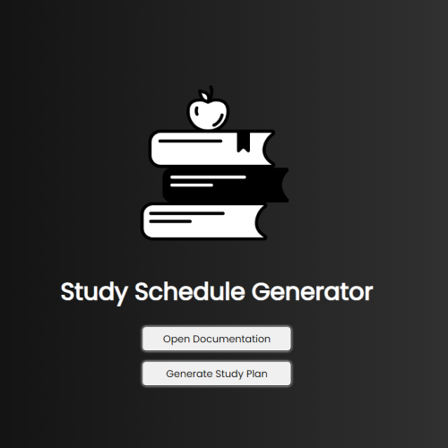

Study Plan Generator
The Study Plan Generator is a web application designed to help users create personalized study plans based on their subjects, available study hours, days per week, and total weeks of study. This documentation provides an overview of the project, its features, and how to use it.

[Study Planner Website](https://study.davidfoxdev.co.uk)

Features
Modal Interface: The application utilizes a modal interface for an intuitive user experience. Users can input their study preferences within the modal window.
Subject Input: Users can input primary, secondary, and tertiary subjects into the modal. Subjects are entered as comma-separated values.
Study Parameters: Users can specify the number of hours available per day, the number of days available per week for study, and the total number of weeks they plan to study.

Generate Study Plan: After inputting study parameters, users can submit their preferences to generate a personalized study plan.

Responsive Design: The application is designed to be responsive, ensuring optimal usability across various devices and screen sizes.
Usage
Opening the Modal: Click on the "Generate Study Plan" button to open the modal interface.
Input Study Preferences: Enter primary, secondary, and tertiary subjects into their respective input fields, separated by commas. Specify the number of hours available per day, days available per week, and the total number of weeks for study.
Generating the Study Plan: Click on the "Submit" button to generate the study plan based on the provided preferences. The generated study plan will be displayed within the modal window.
Technologies Used
HTML: Markup language for creating the structure of the web application.
CSS: Styling language for designing the visual layout and appearance.
JavaScript: Programming language for implementing interactive features and logic.
Modal: Utilized to create an interactive interface for inputting study preferences.
Responsive Design: Implemented to ensure compatibility with various devices and screen sizes.
Future Enhancements
Save and Load Functionality: Allow users to save their study preferences and load them later for convenience.
User Accounts: Implement user accounts to enable personalized study plans and tracking of study progress.
Additional Customization Options: Provide users with more customization options for their study plans, such as priority levels for subjects and study sessions.
Conclusion
The Study Plan Generator offers a convenient solution for users to create personalized study plans tailored to their preferences and schedules. With its intuitive interface and customizable features, users can effectively organize their study routines and optimize their learning experiences.